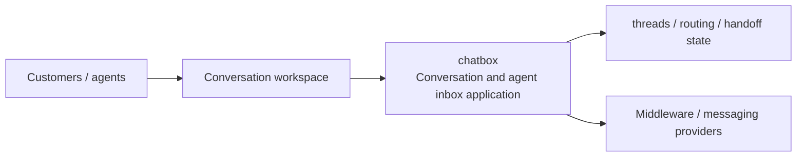
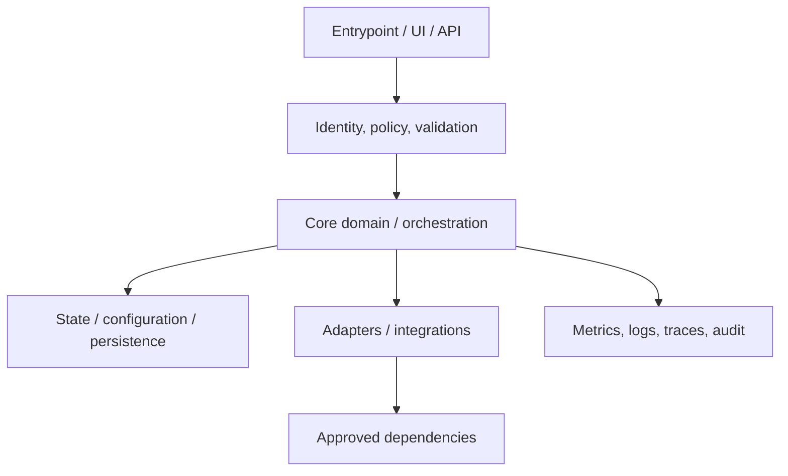
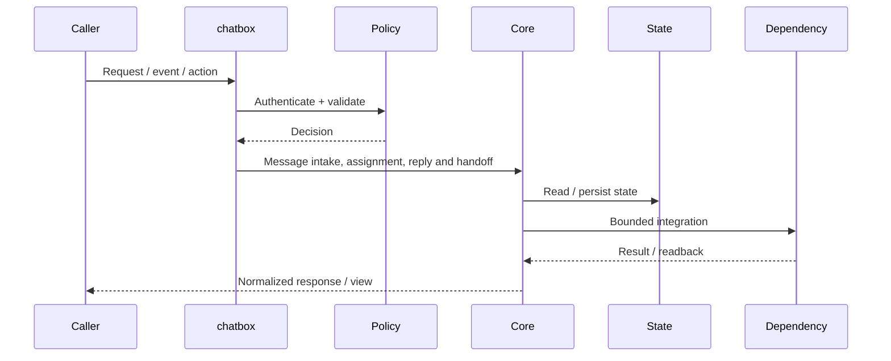
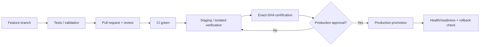
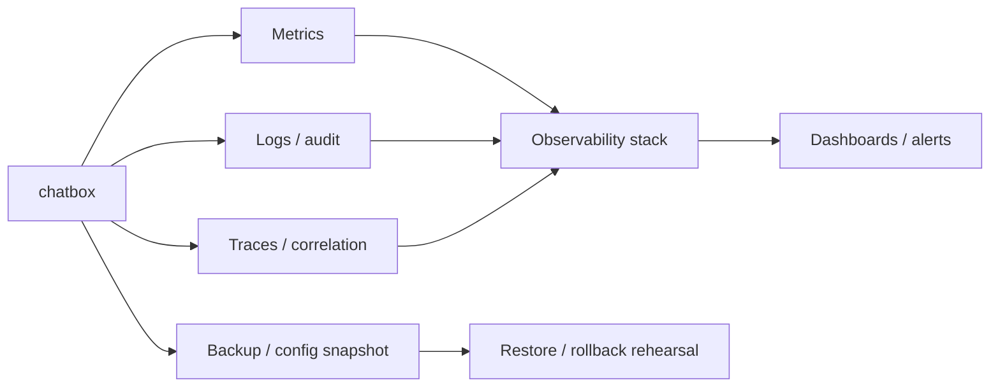

# chatbox — Architecture Charts

> Repository: `appolon1908/chatbox`  
> Baseline branch: `main`  
> Repository-local visual architecture. Keep these diagrams aligned with implementation, contracts and runtime boundaries.

## 1. System context

## 2. Internal component architecture

## 3. Critical runtime flow

## 4. Deployment and promotion

## 5. Observability and recovery

## Ownership notes
- **Role:** Conversation and agent inbox application
- **Primary boundary:** Conversation workspace
- **State/config:** threads / routing / handoff state
- **Dependencies/consumers:** Middleware / messaging providers
- Cross-repository effects must use reviewed contracts; production effects remain separately gated.
